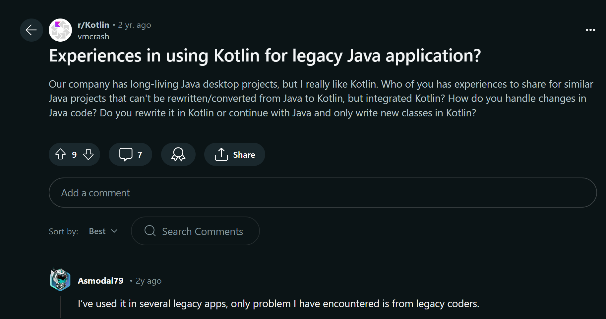
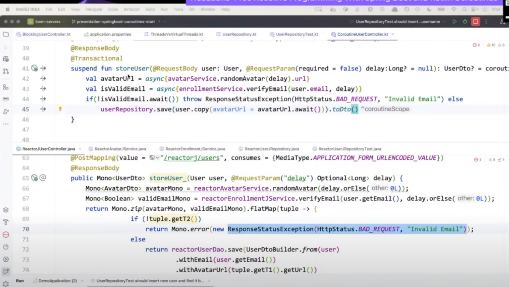

# 關於我用 Kotlin 在 Server Side 開發的那件事
> TSMC IT Community Meetup (Taichung) #3

Kotlin 不只是行動端開發的利器。其現代化特性和卓越的表達性亦得到許多後端開發者的採用。本次將分享個人使用 Kotlin 進行 Server Side 開發達五年以上的經驗與心得。從初次接觸 Kotlin 的那一刻起，講者就深受其簡潔語法和強大功能的吸引。再也回不去 Java 了。

這次講座，將介紹如何利用 Kotlin 的簡潔性和安全性來提升開發效率和程序品質。也展示如何在現有的 Java Spring Boot 專案中無縫的融入 Kotlin。無論是有經驗的 Java 開發者或是想一探 Kotlin 的魔力。這次分享都將幫助你了解 Kotlin 在 server-side 開發中的潛力。加入我們，一起探索使用 Kotlin 進行服務端開發的精彩旅程！

# Slides

[Kotlin x Server Side by Brandy @GoogleDocs](https://docs.google.com/presentation/d/1u_aZKYoKDwB6TiIBbbI-NAeBnOYCORUA9UuAKbgXHnw/edit?usp=sharing)

# Q&A Related 

## 有遇到什麼 Kotlin mixed Java 的問題嗎？
Other legacy coder...

- [處理 platform type](https://ithelp.ithome.com.tw/articles/10316786)

## Kotlin with Java Reflection
- Kotlin 也是 compile 成 .class 可以被 java reflection 使用到
- Kotlin reflection - https://www.baeldung.com/kotlin/reflection
- [Kotlin 與 Java 交互作用小祕方 by Andy](https://www.youtube.com/watch?v=bQjI5zks3z0)  

## Kotlin 與 Python Coroutines 的差異
#### Kotlin
Kotlin 的協程是基於 Continuation-passing style（CPS）轉換的，這意味著掛起函數會被轉換成狀態機以實現非阻塞調度。
Kotlin 協程有自己的調度器，並且可以與多線程環境很好地結合使用，支持並發和並行操作。

#### Python:
Python 的協程是基於生成器（generator）的擴展實現的，通過 yield 關鍵字來實現協程的狀態保存與恢復。
Python 的 asyncio 事件循環是單線程的，因此 Python 的協程更多地用於 I/O 密集型任務，而不是 CPU 密集型任務。

### 使用場景與生態系統

#### Kotlin
Kotlin 的協程經常用於構建高效的服務端應用程序，特別是在需要高併發處理的情況下，如服務器、後端微服務等。
Kotlin 的協程可以與現有的 Java 生態系統無縫結合，例如使用 Spring 框架開發 Web 應用程序。

#### Python
Python 的協程主要用於處理 I/O 密集型任務，如網絡請求、文件讀寫等。這在 Web 開發（如使用 aiohttp）、網絡爬蟲、數據處理等領域尤為常見。
Python 的協程也可以與各種第三方庫集成，例如 asyncio 與 aiomysql、aiohttp 等。

## Kotlin 如何處理 Reactive Programming 的 mono/zip/flux
請服用 Kotlin Coroutines

- [Headache-Free Reactive Programming With Spring Boot and Kotlin Coroutines](https://www.youtube.com/watch?v=ahTXElHrV0c&pp=ygUJdXJzIHBldGVy)
- [電瀨 - Reactive Quarkus with Kotlin Coroutine and MongoDB
](https://docs.google.com/presentation/d/1R3n9c2bEQavh45MOnja7zcqLdDNozScgaUl8ewKfP34/edit#slide=id.p)

